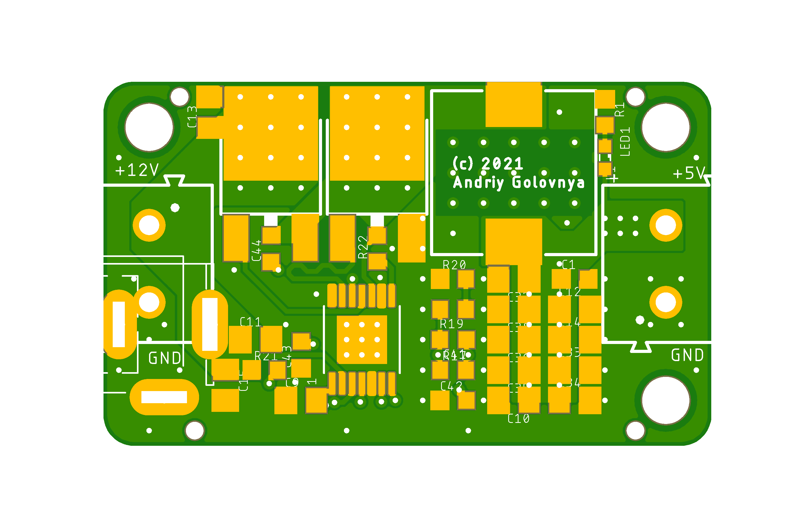
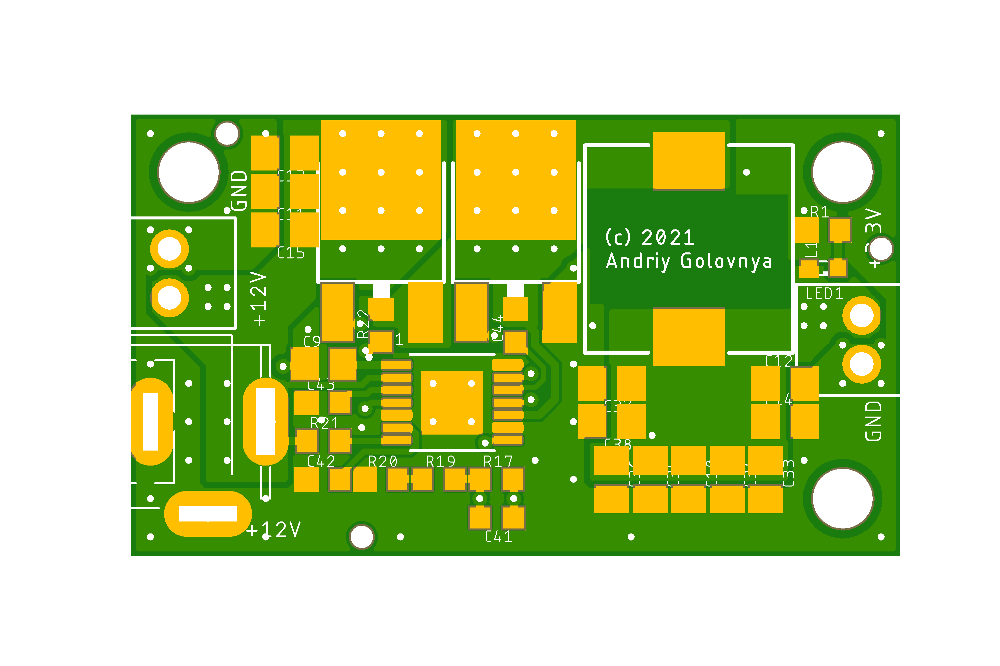

# DC-DC project

This project is intended to implement some simple flexible DC-DC buck converters from basic components.
This project features Excel based component's values calculator.

## DCDC-12V5V5A

**DCDC-12V5V5A** is simple DC-DC step-down converter with fixed output 5V.

Preview:

[Schematics in PDF format](DCDC-12V5V5A.pdf)

Features:

- Input: **12V (6V-24V)**
- Output: **5V**
- Current: **5A (peak 10A)**
- Efficiency: **up to 90%**
- Board size: **40x23mm**

CAM files are available.
BoM and PnP files for JLCPCB are available.

## DCDC-12V3V5A

**DCDC-12V3V5A** is simple DC-DC step-down converter with fixed output 3.3V.

Preview:

[Schematics in PDF format](DCDC-12V3V5A.pdf)

Features:

- Input: **12V (5V-24V)**
- Output: **3.3V**
- Current: **5A (peak 10A)**
- Efficiency: **up to 90%**
- Board size: **40x23mm**

CAM files are available.
BoM and PnP files for JLCPCB are available.

## DCDC-17V12V5A

**DCDC-17V12V5A** is simple DC-DC step-down converter with fixed output 12V.

Preview:

[Schematics in PDF format](DCDC-17V12V5A.pdf)

Features:

- Input: **17V (14V-24V)**
- Output: **12V**
- Current: **5A (peak 10A)**
- Efficiency: **up to 90%**
- Board size: **40x23mm**

CAM files are available.
BoM and PnP files for JLCPCB are available.

## How to help

Your contributions as code, resources or finances are welcome!
Please contact me directly over e-mail andriy.golovnya@gmail.com or over [GitHub profile](https://github.com/red-scorp).
Link for [Paypal donations](http://paypal.me/redscorp), which are always welcome.
Thanks in advance!
