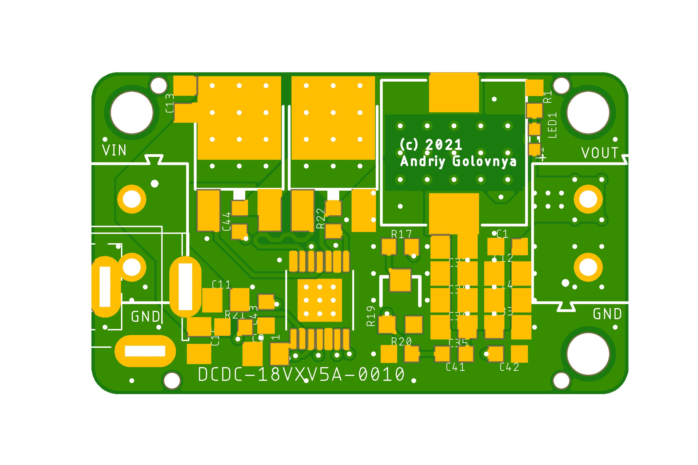
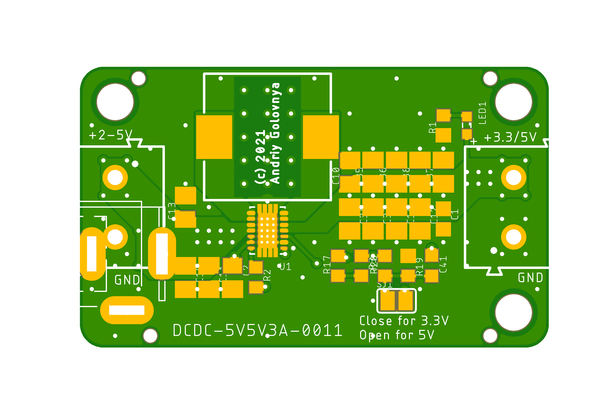
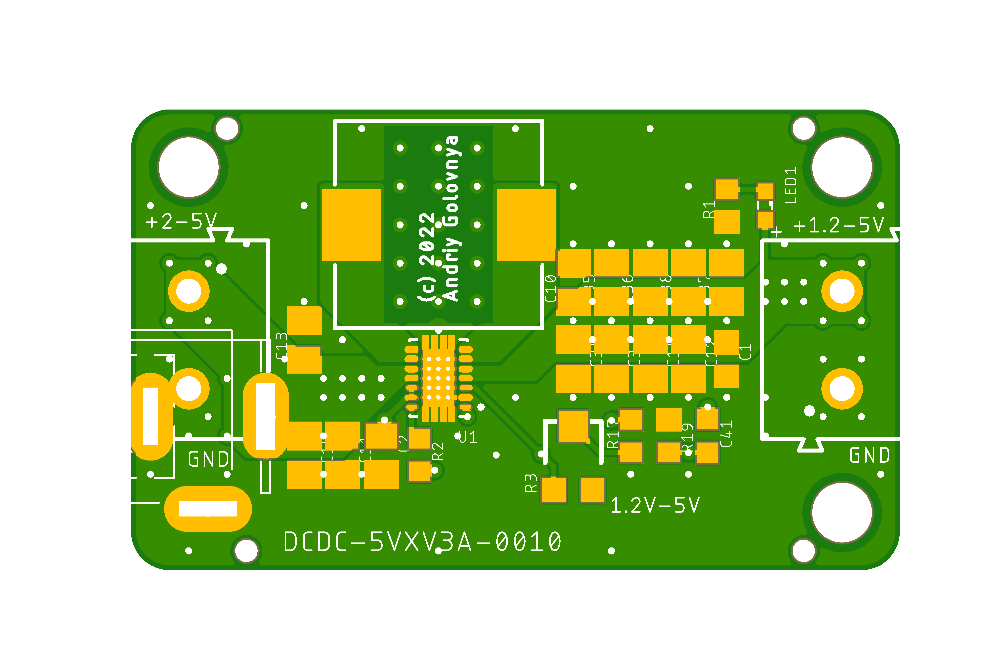
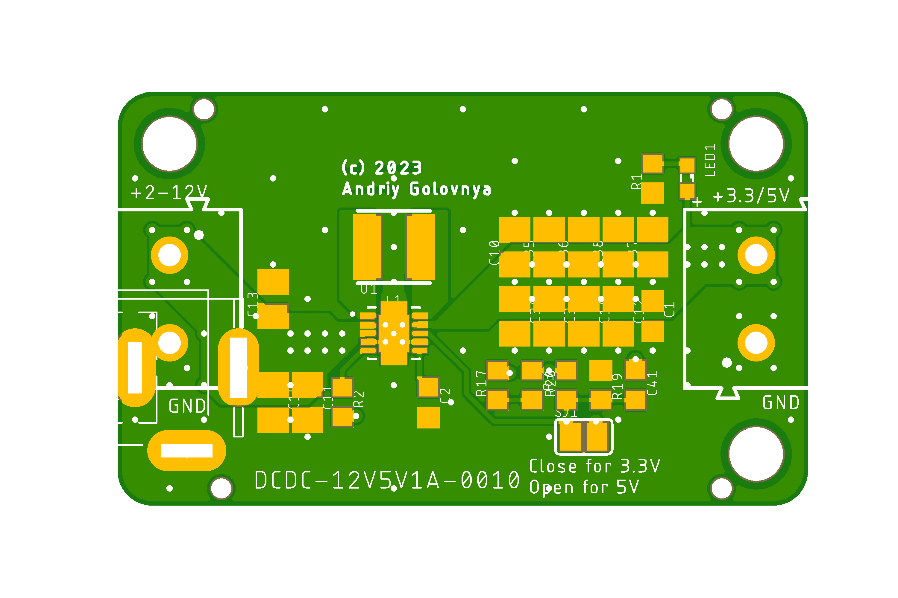
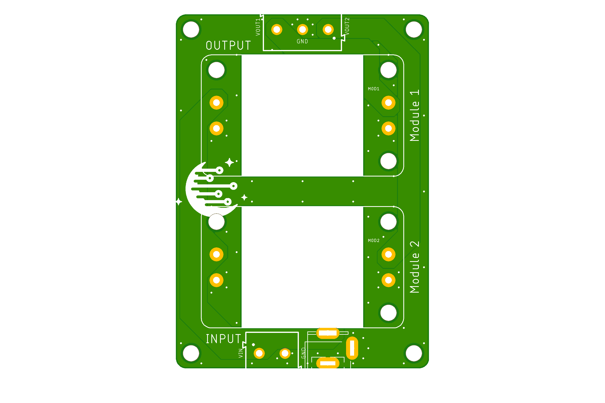

# DC/DC project

This project is intended to implement some simple multipurpose DC/DC buck and buck-boost converters from easy available components.
This project also features Excel based component values calculator.

I've stared this project to create stable and high quality DC/DC module for my private projects, covering most common usecases:

- Step-down to most common fixed voltages 3.3V, 5V and 12V up to 5A
- Step-up/down from 1.8V-5.5V to 3.3V and 5V up to 3A
- Step-up/down from 2.5V-12V to 3.3V and 5V up to 1A

## DCDC-12V5V5A

**DCDC-12V5V5A** is simple DC/DC step-down converter with fixed output 5V.
When used for more than 1A current it's recommended to glue a heat sink about 20x20mm in a middle of the bottom side of the board.

Preview:

[Schematics in PDF format](doc/DCDC-12V5V5A.pdf)

Features:

- Input: **12V (7V-24V)**
- Output: **5V**
- Current: **5A (peak 10A)**
- Switching: **500kHz**
- Efficiency: **up to 90%**
- Board size: **40x24mm**
- Based on: **Ti LM3150**

CAM files are available.
BoM and PnP files for JLCPCB are available.

## DCDC-12V3V5A

**DCDC-12V3V5A** is simple DC/DC step-down converter with fixed output 3.3V.
When used for more than 1A current it's recommended to glue a heat sink about 20x20mm in a middle of the bottom side of the board.

Preview:

[Schematics in PDF format](doc/DCDC-12V3V5A.pdf)

Features:

- Input: **12V (5V-24V)**
- Output: **3.3V**
- Current: **5A (peak 10A)**
- Switching: **600kHz**
- Efficiency: **up to 90%**
- Board size: **40x24mm**
- Based on: **Ti LM3150**

CAM files are available.
BoM and PnP files for JLCPCB are available.

## DCDC-18V12V5A

**DCDC-18V12V5A** is simple DC/DC step-down converter with fixed output 12V.
When used for more than 1A current it's recommended to glue a heat sink about 20x20mm in a middle of the bottom side of the board.

Preview:

[Schematics in PDF format](doc/DCDC-18V12V5A.pdf)

Features:

- Input: **18V (14V-24V)**
- Output: **12V**
- Current: **5A (peak 10A)**
- Switching: **500kHz**
- Efficiency: **up to 90%**
- Board size: **40x24mm**
- Based on: **Ti LM3150**

CAM files are available.
BoM and PnP files for JLCPCB are available.

## DCDC-18VXV5A

**DCDC-18VXV5A** is simple DC/DC step-down converter with selectable output 2-12V.
When used for more than 1A current it's recommended to glue a heat sink about 20x20mm in a middle of the bottom side of the board.

Preview:

[Schematics in PDF format](doc/DCDC-18VXV5A.pdf)

Features:

- Input: **18V (5V-24V)**
- Output: **2-12V**
- Current: **5A (peak 10A)**
- Switching: **500kHz**
- Efficiency: **up to 90%**
- Board size: **40x24mm**
- Based on: **Ti LM3150**

CAM files are available.
BoM and PnP files for JLCPCB are available.

## DCDC-5V5V3A

**DCDC-5V5V3A** is simple DC/DC step-up/down converter with selectable fixed output 3.3/5V.
When used for more than 1A current it's recommended to glue a heat sink about 20x20mm in a middle of the bottom side of the board.

Preview:

[Schematics in PDF format](doc/DCDC-5V5V3A.pdf)

Features:

- Input: **1.8-5.5V**
- Output: **3.3/5V (select)**
- Current: **3A (peak 5A)**
- Switching: **2.4MHz**
- Efficiency: **up to 90%**
- Board size: **40x24mm**
- Based on: **Ti TPS63020**

CAM files are available.
BoM and PnP files for JLCPCB are available.

## DCDC-5VXV3A

**DCDC-5VXV3A** is simple DC/DC step-up/down converter with selectable output 1.2-5V.
When used for more than 1A current it's recommended to glue a heat sink about 20x20mm in a middle of the bottom side of the board.

Preview:

[Schematics in PDF format](doc/DCDC-5VXV3A.pdf)

Features:

- Input: **1.8-5.5V**
- Output: **1.2-5V**
- Current: **3A (peak 5A)**
- Switching: **2.4MHz**
- Efficiency: **up to 90%**
- Board size: **40x24mm**
- Based on: **Ti TPS63020**

CAM files are available.
BoM and PnP files for JLCPCB are available.

## DCDC-12V5V1A

**DCDC-12V5V1A** is simple DC/DC step-up/down converter with selectable fixed output 3.3/5V.
When used for more than 1A current it's recommended to glue a heat sink about 20x20mm in a middle of the bottom side of the board.

Preview:

[Schematics in PDF format](doc/DCDC-12V5V1A.pdf)

Features:

- Input: **2.5-12V**
- Output: **3.3/5V (select)**
- Current: **1A (peak 2A)**
- Switching: **2.4MHz**
- Efficiency: **up to 90%**
- Board size: **40x24mm**
- Based on: **Ti TPS63060**

CAM files are available.

## DCDC-BASE-X2A

**DCDC-BASE-X2A** is base board for 2 DC/DC modules with common input and two separate outputs.
When used for more than 1A current it's recommended to glue a heat sinks about 20x20mm in a middle of the bottom side of DCDC boards before soldering them to the base board.

Preview:

[Schematics in PDF format](doc/DCDC-BASE-X2A.pdf)

Features:

- Fits two compatible DCDC modules
- Common/single input
- Two separate outputs
- Compatible with heat sinks up to 24x24mm
- Supports direct and/or hole through soldering of DCDC modules

CAM files are available.

## DCDC-BASE-X2B

**DCDC-BASE-X2B** is base board for 2 DC/DC modules with common input and two separate outputs.
When used for more than 1A current it's recommended to glue a heat sinks about 20x20mm in a middle of the bottom side of DCDC boards before soldering them to the base board.

Preview:

[Schematics in PDF format](doc/DCDC-BASE-X2B.pdf)

Features:

- Fits two compatible DCDC modules
- Common/single input
- Two separate outputs
- Compatible with heat sinks up to 24x24mm
- Supports direct and/or hole through soldering of DCDC modules

CAM files are available.

## DCDC-BOX

**DCDC-BOX** is a enclosure for a single DCDC module, suitable for FDM and SLA 3D printing.

STL file is available.

## DCDC-BOX-X2

**DCDC-BOX-X2** is a enclosure for a X2A and X2B base boards, suitable for FDM and SLA 3D printing.

STL file is available.

## Links

- Interesting paper from Ti [Under the hood of a noninverting buck-boost converter](https://www.ti.com/seclit/ml/slup346/slup346.pdf)
- Product page [Ti LM3150](https://www.ti.com/product/LM3150)
- Product page [Ti TPS63020](https://www.ti.com/product/TPS63020)
- Product page [Ti TPS63060](https://www.ti.com/product/TPS63060)

## How to help

Your contributions as code, resources, or finances are welcome! Please contact me directly via email at andriy.golovnya@gmail.com or through my [GitHub profile](https://github.com/red-scorp).

If you'd like to make a financial contribution, you can donate via [PayPal](http://paypal.me/redscorp) or [Ko-Fi](http://ko-fi.com/redscorp). Your support is greatly appreciated.

Thanks in advance!
